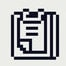

# My_Paint project

## Done by Armand DUFRESNE and Régis CARRERE

### Overview

This project is a first year project of Epitech, :desktop_computer: 
And its goal is to recreate a paint in CSFML in 3 weeks. 

### Features

* You can save your work as a screenshot
* You can open paint with one of your previous work
* If you don't know how to use paint you can click on this icon  to get help

### Running this project locally

* Clone this repository loclly
* Run `make` in your terminal
* Run `./my_paint`

Then enjoy our paint. 

The list of the tools we used to do this project :hammer_and_wrench: 

